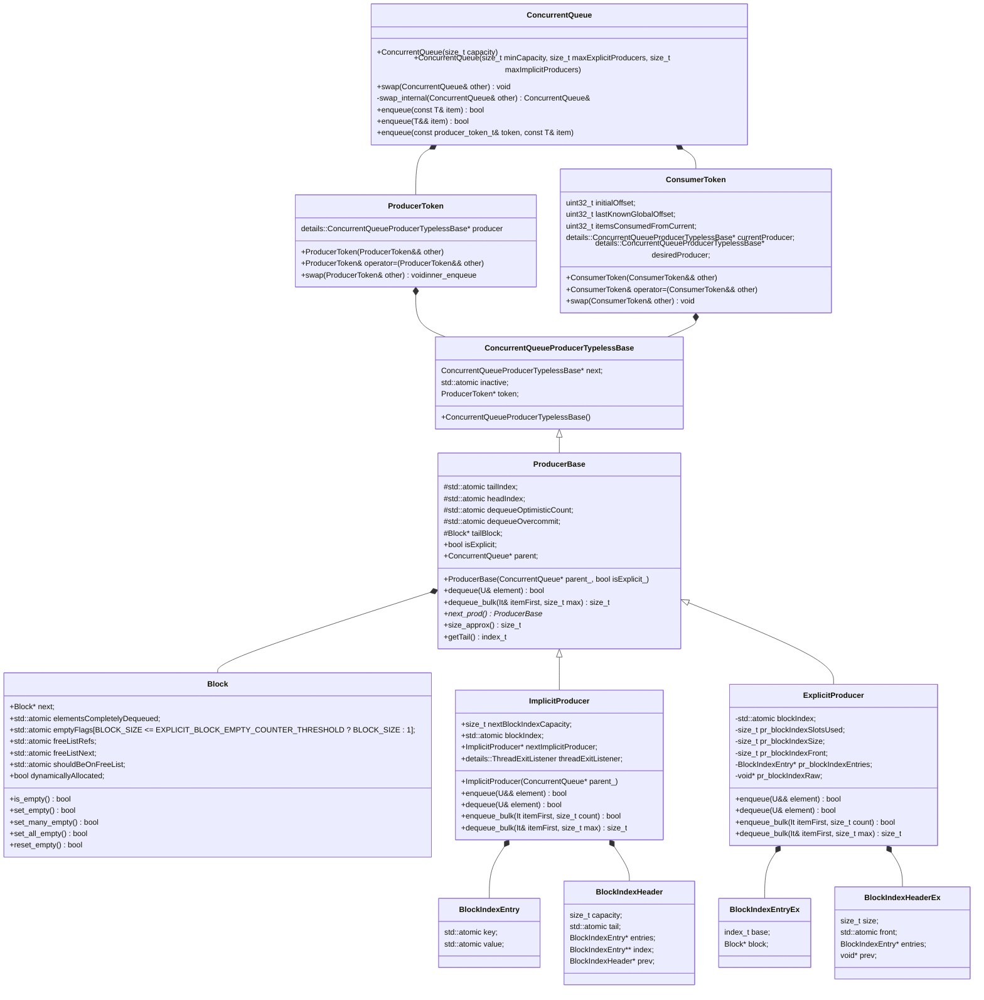

```mermaid
classDiagram
	class ConcurrentQueueProducerTypelessBase{
		+ConcurrentQueueProducerTypelessBase()
		
		ConcurrentQueueProducerTypelessBase* next;
		std::atomic<bool> inactive;
		ProducerToken* token;
	}
	
	class ProducerBase{
		+ProducerBase(ConcurrentQueue* parent_, bool isExplicit_)
		+dequeue(U& element) bool
		+dequeue_bulk(It& itemFirst, size_t max) size_t
		+next_prod() ProducerBase*
		+size_approx() size_t
		+getTail() index_t
		
		#std::atomic<index_t> tailIndex;
		#std::atomic<index_t> headIndex;
		
		#std::atomic<index_t> dequeueOptimisticCount;
		#std::atomic<index_t> dequeueOvercommit;
		
		#Block* tailBlock;
		
		+bool isExplicit;
		+ConcurrentQueue* parent;
	}
	
	class Block{
		+is_empty() bool
		+set_empty() bool
		+set_many_empty() bool
		+set_all_empty() bool
		+reset_empty() bool
		
		
		+Block* next;
		+std::atomic<size_t> elementsCompletelyDequeued;
		+std::atomic<bool> emptyFlags[BLOCK_SIZE <= EXPLICIT_BLOCK_EMPTY_COUNTER_THRESHOLD ? BLOCK_SIZE : 1];
		
		+std::atomic<std::uint32_t> freeListRefs;
		+std::atomic<Block*> freeListNext;
		+std::atomic<bool> shouldBeOnFreeList;
		+bool dynamicallyAllocated;
	}
	
	class ProducerToken{
		+ProducerToken(ProducerToken&& other)
		+ProducerToken& operator=(ProducerToken&& other)
		+swap(ProducerToken& other) voidinner_enqueue
		
		details::ConcurrentQueueProducerTypelessBase* producer
	}
	
	class BlockIndexEntry {
        std::atomic<index_t> key;
        std::atomic<Block*> value;
    }
    
    class BlockIndexHeader {
        size_t capacity;
        std::atomic<size_t> tail;
        BlockIndexEntry* entries;
        BlockIndexEntry** index;
        BlockIndexHeader* prev;
    }
		
	class ImplicitProducer{
		+ImplicitProducer(ConcurrentQueue* parent_)
		+enqueue(U&& element) bool
		+dequeue(U& element) bool
		+enqueue_bulk(It itemFirst, size_t count) bool
		+dequeue_bulk(It& itemFirst, size_t max) size_t
		
		+size_t nextBlockIndexCapacity;
		+std::atomic<BlockIndexHeader*> blockIndex;
		+ImplicitProducer* nextImplicitProducer;
		+details::ThreadExitListener threadExitListener;
	}
	ImplicitProducer *-- BlockIndexEntry
	ImplicitProducer *-- BlockIndexHeader
	
	class BlockIndexEntryEx {
        index_t base;
        Block* block;
    }
    
    class BlockIndexHeaderEx {
        size_t size;
        std::atomic<size_t> front;
        BlockIndexEntry* entries;
        void* prev;
    }
    
	class ExplicitProducer{
		+enqueue(U&& element) bool
		+dequeue(U& element) bool
		+enqueue_bulk(It itemFirst, size_t count) bool
		+dequeue_bulk(It& itemFirst, size_t max) size_t
		
		-std::atomic<BlockIndexHeader*> blockIndex;
		-size_t pr_blockIndexSlotsUsed;
		-size_t pr_blockIndexSize;
		-size_t pr_blockIndexFront;
		-BlockIndexEntry* pr_blockIndexEntries;
		-void* pr_blockIndexRaw;
	}
	
	ExplicitProducer *-- BlockIndexEntryEx
	ExplicitProducer *-- BlockIndexHeaderEx
	
	class ConsumerToken{
		+ConsumerToken(ConsumerToken&& other)
		+ConsumerToken& operator=(ConsumerToken&& other)
		+swap(ConsumerToken& other) void
		
		uint32_t initialOffset;
		uint32_t lastKnownGlobalOffset;
		uint32_t itemsConsumedFromCurrent;
		details::ConcurrentQueueProducerTypelessBase* currentProducer;
		details::ConcurrentQueueProducerTypelessBase* desiredProducer;
	}
	
	class ConcurrentQueue{
		+ConcurrentQueue(size_t capacity)
		+ConcurrentQueue(size_t minCapacity, size_t maxExplicitProducers, size_t maxImplicitProducers)
		
		+swap(ConcurrentQueue& other) void
		-swap_internal(ConcurrentQueue& other) ConcurrentQueue&
		
		+enqueue(const T& item) bool
		+enqueue(T&& item) bool
		+enqueue(const producer_token_t& token, const T& item)
	}
	
	ProducerBase *-- Block
	ProducerBase <|-- ImplicitProducer
	ProducerBase <|-- ExplicitProducer
	ConcurrentQueueProducerTypelessBase <|-- ProducerBase
	ProducerToken *-- ConcurrentQueueProducerTypelessBase
	ConsumerToken *-- ConcurrentQueueProducerTypelessBase
	ConcurrentQueue *-- ProducerToken
	ConcurrentQueue *-- ConsumerToken

```

